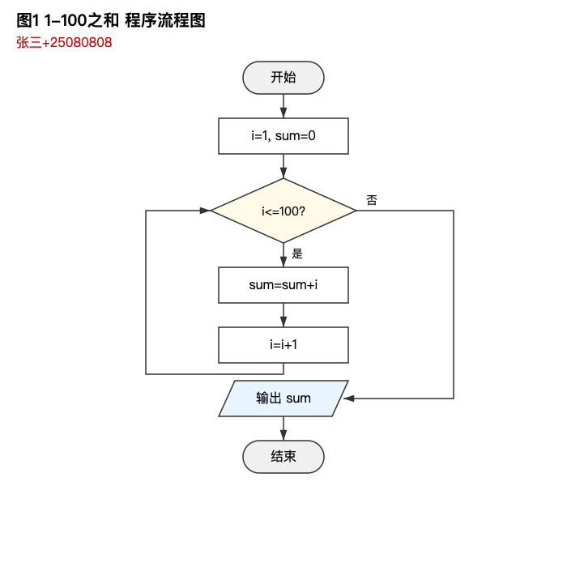
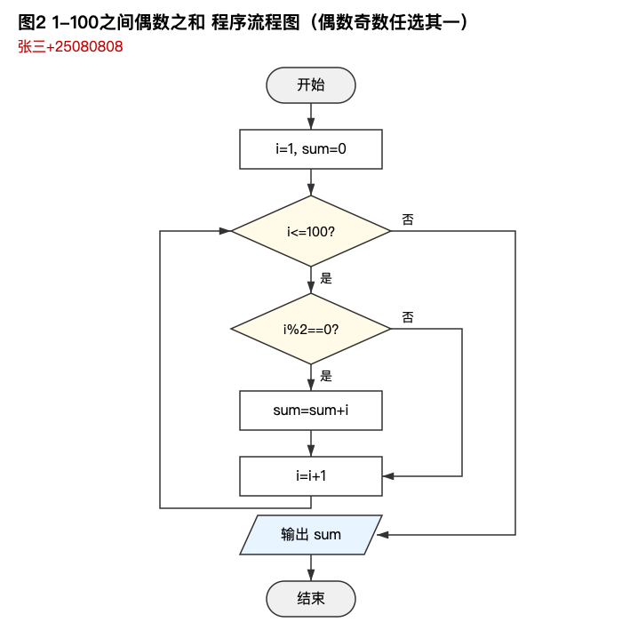
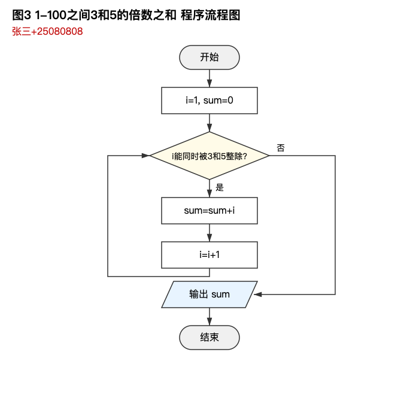
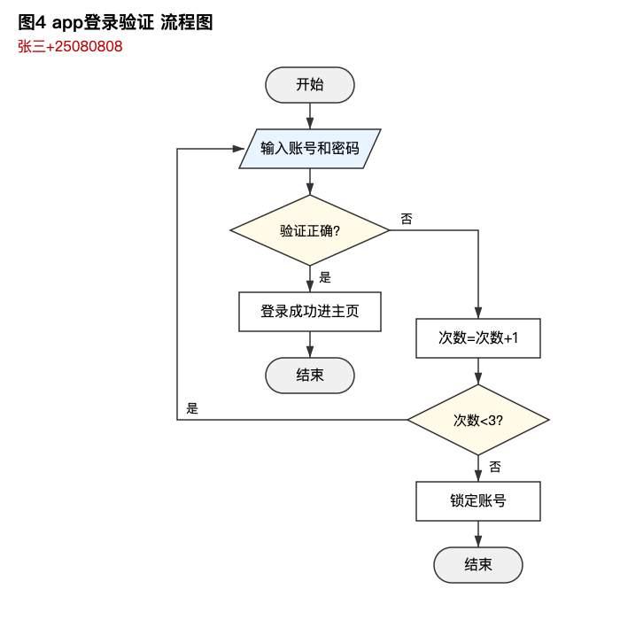

# C 语言课程实践

C 语言课程的课堂实践作业，共 6 次实践，从基础输出逐步做到用函数和菜单把全部题目整合成一个程序。

全部代码为单文件 C89/C99 风格，只用标准库（`stdio.h` / `string.h`），无第三方依赖。

## 编译运行

```bash
gcc -Wall -Wextra -std=c11 prac6.c -o prac6
./prac6
```

每个 `.c` 文件都是独立可执行程序，把文件名换成 `prac1`…`prac5` 或 `bonus` 即可。

## 目录

| 文件 | 实践 | 内容 |
| --- | --- | --- |
| `prac1.c` | 实践 1 | 基础输出：Hello World、阶梯形星号、专业班级姓名学号 |
| `prac2.c` | 实践 2 | 实践 2 流程图对应的代码：三种累加求和、app 登录验证 |
| `prac3.c` | 实践 3 | 选择结构：三数最大最小、成绩折算 ABCDE、三数升序 |
| `prac4.c` | 实践 4 | 循环结构：`for` 求 1-100 和、`while` 求奇偶和、`do-while` 求 3 和 5 的倍数和 |
| `prac5.c` | 实践 5 | 函数与数组：最大最小值、等级转换、奇偶求和、数组正逆序、平均值、冒泡排序 |
| `prac6.c` | 实践 6 | 课程设计总结：`while` + `switch` 菜单整合以上全部 14 项 |
| `bonus.c` | 奖励题 | 输入十个数按升序排列输出（独立文件） |
| `flow/` | 实践 2 | 4 张程序流程图，`.svg` 为源文件，`.png` 为渲染成品 |

## 流程图

实践 2 要求先画流程图再写代码，四张图与 `prac2.c` 的四道题逐节点对应。

| 1-100 之和 | 偶数之和 | 3 和 5 的倍数之和 | app 登录验证 |
| --- | --- | --- | --- |
|  |  |  |  |

## 几处实现说明

- **"3 和 5 的倍数之和"有两种理解**，`prac4.c` 和 `prac6.c` 把两个结果都算出来：同时是 3 和 5 的倍数（即 15 的倍数）之和为 315，是 3 或 5 的倍数之和为 2418。`prac2.c` 按流程图口径只算前者。
- **`prac6.c` 的菜单做了输入校验**：`scanf` 读到非数字时不会消耗该字符，若不丢弃就会反复读到同一个坏字符造成死循环，因此检查返回值并用 `getchar()` 清掉整行；读到 `EOF` 时按退出处理。
- **平均值用 `(double) sum / len`**，整数直接相除会丢掉小数部分。
- **数组不能整体赋值**，复制要逐元素拷贝；`prac5.c` 里排序、求最大最小都以数组名作参数传指针。
- 代码注释里的姓名学号是课程要求，此处为示例值。
